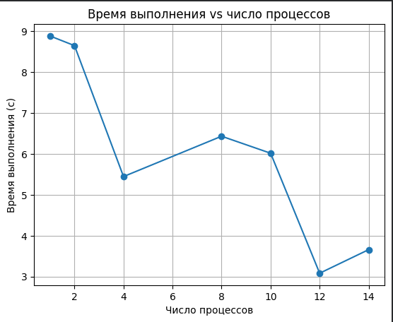
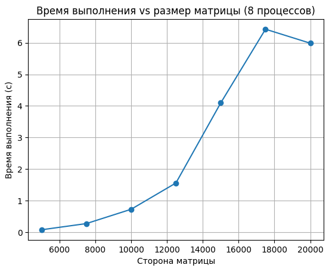
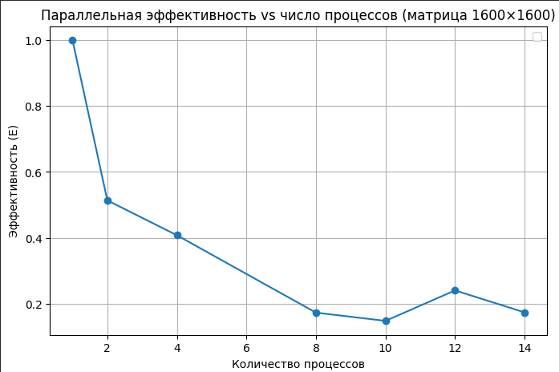
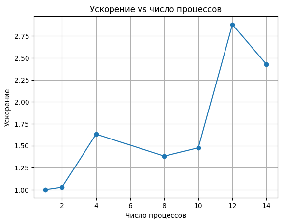
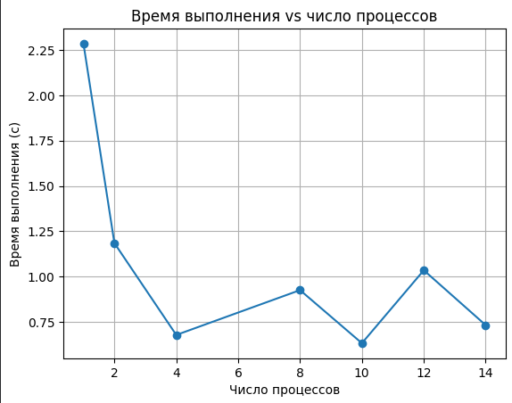
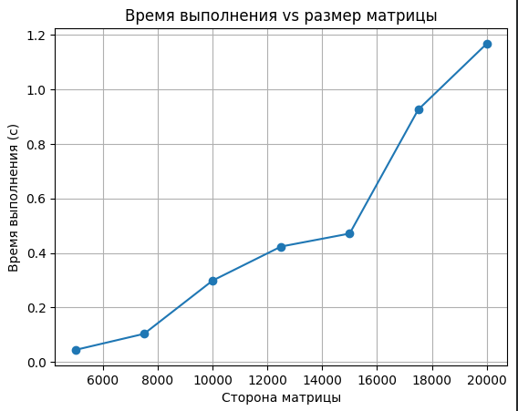
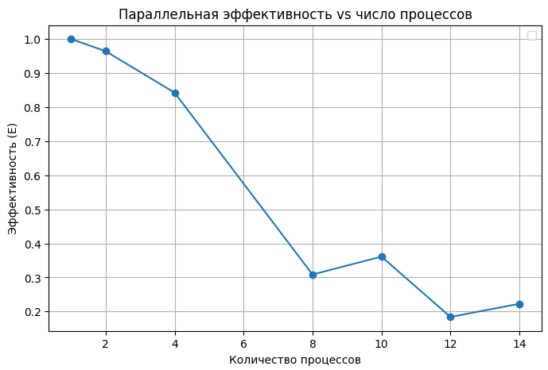
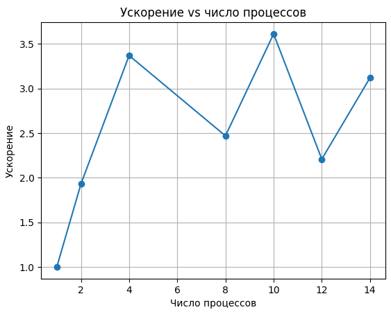

# Lab1

# Task1

В этой работе мы вычисляли число π.

## График зависимости времени от числа процессов

## График зависимости времени от числа испытаний

## График эффективности

## График ускорения

Параллелизация даёт ускорение, но на малых испытаниях (100–1000) накладные расходы MPI делают многопроцессное выполнение не всегда быстрее.
На больших испытаниях (100 000 и 1 000 000) выигрыш от параллельности очевиден.

# Task2
# Разбиение по строкам

## График зависимости времени от числа процессов

## График зависимости времени от Размера матрциы

## График эффективности

## График ускорения

Время уменьшается почти идеально с увеличением числа процессов, особенно когда размер матрицы кратен числу процессов.

При не кратном размере видно замедление. Это связано с тем, что некоторые процессы получают больше строк, чем другие, и они становятся узким местом.

Разбиение по строкам простое и эффективно, но чувствительно к остаткам при делении.

# Разбиение по столбцам

## График зависимости времени от числа процессов

## График зависимости времени от Размера матрциы

## График эффективности

## График ускорения

Для матриц, кратных числу процессов, ускорение хорошее.

Для размеров, не кратных процессам, появляются аномалии: некоторые процессы получают больше столбцов → неравномерная нагрузка → время может увеличиваться при добавлении процессов.

Алгоритм менее стабильный при некратных размерах. Для крупных матриц важно выбирать число процессов, кратное количеству столбцов.

# Разбиение по блокам

## График зависимости времени от числа процессов

## График зависимости времени от Размера матрциы

## График эффективности

## График ускорения

Более равномерное распределение нагрузки, чем по строкам или столбцам.

Ускорение лучше при некратных размерах, т.к. лишние элементы делятся по блокам.

Для некоторых конфигураций время немного увеличивается из-за сложности коммуникаций при суммировании блоков.

Вывод: разбиение по блокам обеспечивает наилучший баланс нагрузки при произвольных размерах матрицы и числе процессов.
