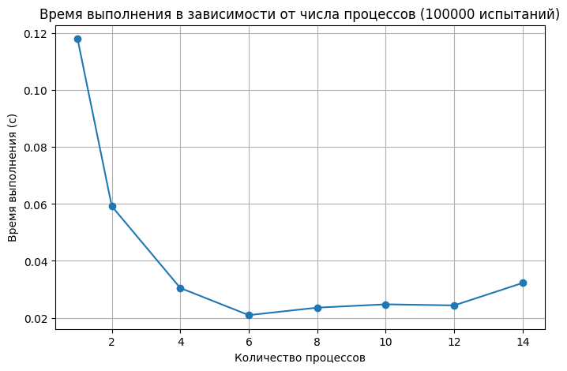
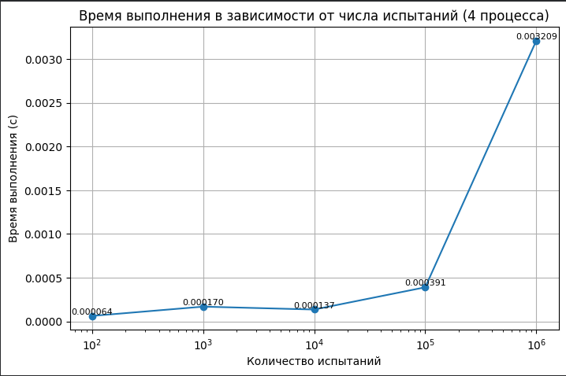
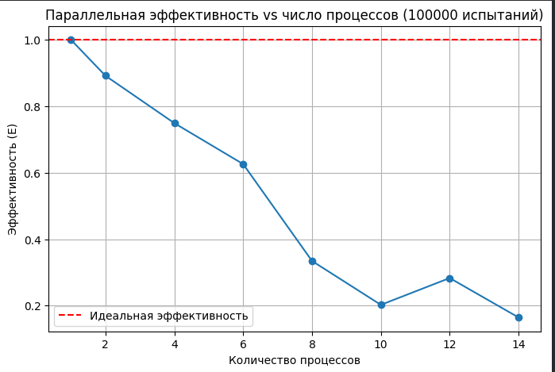
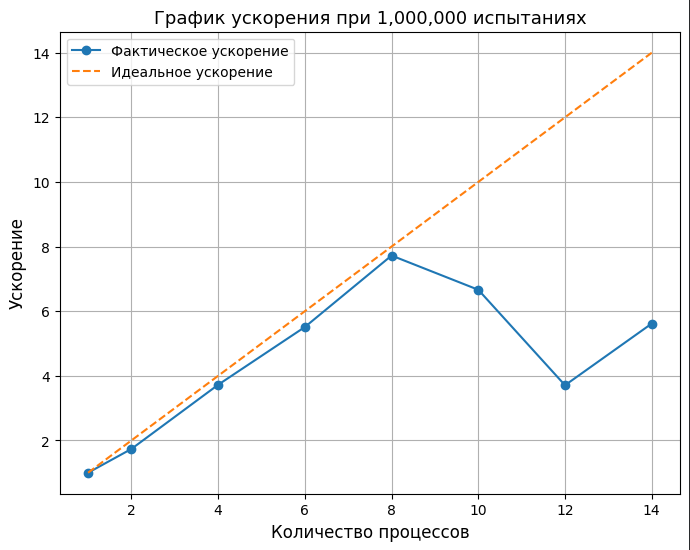
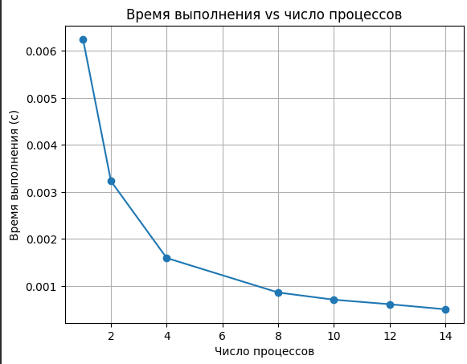
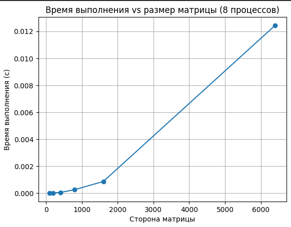
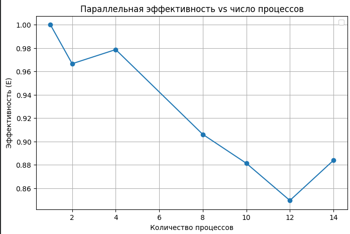
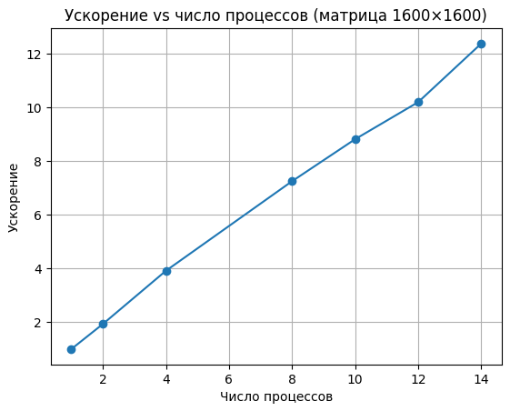

# Lab1

# Task1

В этой работе мы вычисляли число π.

## График зависимости времени от числа процессов

## График зависимости времени от числа испытаний

## График эффективности

## График ускорения

Параллелизация даёт ускорение, но на малых испытаниях (100–1000) накладные расходы MPI делают многопроцессное выполнение не всегда быстрее.
На больших испытаниях (100 000 и 1 000 000) выигрыш от параллельности очевиден.

# Task2
# Разбиение по строкам

## График зависимости времени от числа процессов

## График зависимости времени от Размера матрциы

## График эффективности

## График ускорения

